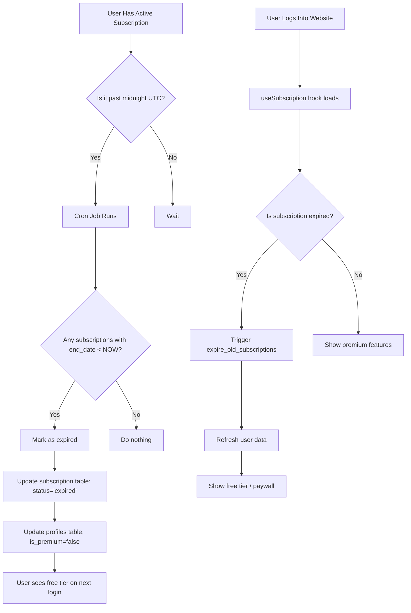

# How Subscription Expiry Works

## The Two-Layer Expiry System

Your subscription expiry now works with **two mechanisms** for redundancy:

### Layer 1: Supabase Cron Job (Primary) ⏰

```
Daily at Midnight UTC:
┌─────────────────────────────────────────────────────┐
│  Supabase pg_cron runs:                             │
│  SELECT expire_old_subscriptions();                 │
└─────────────────────┬───────────────────────────────┘
                      │
                      ▼
┌─────────────────────────────────────────────────────┐
│  Function checks ALL subscriptions:                 │
│  WHERE status = 'active' AND end_date < NOW()      │
└─────────────────────┬───────────────────────────────┘
                      │
                      ▼
┌─────────────────────────────────────────────────────┐
│  For each expired subscription:                     │
│  1. UPDATE subscriptions SET status = 'expired'     │
│  2. UPDATE profiles SET is_premium = false          │
│                         subscription_tier = 'free'  │
│                         subscription_expires_at = NULL │
└─────────────────────────────────────────────────────┘
```

**When it runs**: Every day at 00:00 UTC (5:30 AM IST)

**What you need to do**: Set up the cron job once using the SQL in `CRON_JOB_SETUP.md`

### Layer 2: Client-Side Check (Fallback) 🔍

```
User logs into website:
┌─────────────────────────────────────────────────────┐
│  useSubscription hook loads                         │
│  Fetches user's subscription data                   │
└─────────────────────┬───────────────────────────────┘
                      │
                      ▼
┌─────────────────────────────────────────────────────┐
│  Client-side expiry check:                          │
│  IF current_time > subscription_expires_at          │
└─────────────────────┬───────────────────────────────┘
                      │
                      ▼ (if expired)
┌─────────────────────────────────────────────────────┐
│  Triggers on server:                                │
│  supabase.rpc('expire_old_subscriptions')          │
└─────────────────────┬───────────────────────────────┘
                      │
                      ▼
┌─────────────────────────────────────────────────────┐
│  User's session refreshes with free tier status    │
└─────────────────────────────────────────────────────┘
```

**When it runs**: Every time a user with an expired subscription logs in

**Purpose**: Safety net in case cron job fails or subscription expires between cron runs

## Example Timeline

**Day 1 (Nov 1)**: User gets 1-month premium
- `start_date`: 2024-11-01 00:00:00
- `end_date`: 2024-12-01 00:00:00
- `status`: 'active'
- `is_premium`: true

**Day 25 (Nov 25)**: User sees expiry warning
- Shows in UI: "Expires in 6 days"
- Warning appears because `daysRemaining <= 4` would trigger soon

**Day 30 (Nov 30)**: Last day of premium
- Still shows: "Expires in 1 day"
- User can still use premium features

**Day 31 (Dec 1) at 00:00 UTC (5:30 AM IST)**:
```
Cron job runs automatically:
┌─────────────────────────────────────┐
│ expire_old_subscriptions() finds:  │
│ - end_date: 2024-12-01 00:00:00    │
│ - current: 2024-12-01 05:30:00     │
│ - Expired: TRUE                     │
└─────────────────┬───────────────────┘
                  │
                  ▼
         Updates database:
         status → 'expired'
         is_premium → false
         subscription_tier → 'free'
```

**Day 31 (Dec 1) at 9:00 AM**: User logs in
- Subscription already marked as expired by cron job
- `useSubscription` hook loads and shows free tier
- User sees paywall on premium features

**IF CRON FAILED** - Day 31 at 9:00 AM:
```
User logs in → Client-side check detects expiry
              ↓
          Calls expire_old_subscriptions()
              ↓
          Database updated
              ↓
          UI shows free tier immediately
```

## Visual Flow Diagram



## What You Need to Do

### One-Time Setup (Important!)
Run this SQL in Supabase to enable the cron job:
```sql
SELECT cron.schedule(
    'expire-subscriptions-daily',
    '0 0 * * *',
    $$SELECT expire_old_subscriptions();$$
);
```

### Ongoing
- Nothing! It runs automatically every day
- Monitor with the queries in `subscription_audit_queries.sql`

## Verification

To check if cron is running:
```sql
-- See cron job schedule
SELECT * FROM cron.job WHERE jobname = 'expire-subscriptions-daily';

-- See recent executions
SELECT * FROM cron.job_run_details
WHERE jobid = (SELECT jobid FROM cron.job WHERE jobname = 'expire-subscriptions-daily')
ORDER BY start_time DESC
LIMIT 5;
```
